# Lab AB4 — Analyse statique d’un APK avec JADX GUI  

# Task 1 — Préparer le Workspace et Vérifier l’APK

---

## 1. Création du dossier de travail
<p align="center"> 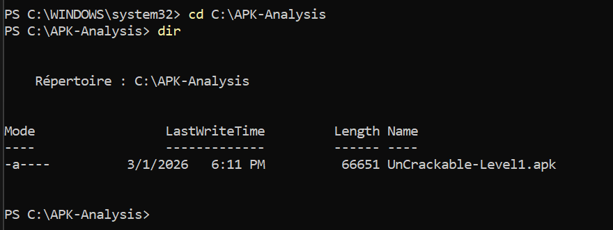 </p>

Sous Windows, le dossier suivant a été créé :

```powershell
mkdir C:\APK-Analysis
cd C:\APK-Analysis
```

Ce dossier centralise :

- L’APK
- Les fichiers DEX extraits
- Le JAR généré
- Les outils utilisés

---

## 2. Copie de l’APK

Le fichier suivant a été placé dans le dossier :

```
UnCrackable-Level1.apk
```

Vérification de la présence du fichier :

```powershell
dir *.apk
```

---

## 3. Vérification du format APK (archive ZIP)

<p align="center"> 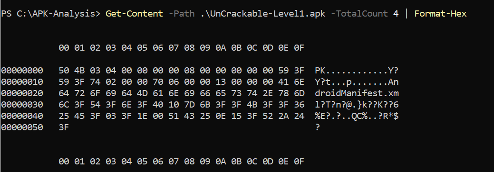 </p>

Un fichier APK est une archive ZIP. 
Commande utilisée :

```powershell
Get-Content -Path .\UnCrackable-Level1.apk -TotalCount 4 | Format-Hex
```

Résultat observé :

```
50 4B 03 04
```
Confirmation que l’APK est une archive ZIP valide.

---

## 4. Liste du contenu de l’APK
<p align="center"> 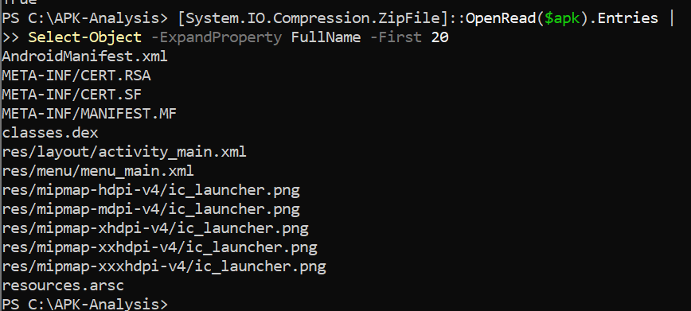 </p>

Commande utilisée :

```powershell
Add-Type -AssemblyName System.IO.Compression.FileSystem
[System.IO.Compression.ZipFile]::OpenRead("UnCrackable-Level1.apk").Entries | Select-Object -First 20
```

Éléments observés :

- AndroidManifest.xml
- classes.dex
- resources.arsc
- META-INF/
- res/

Structure standard d’un APK Android confirmée.

---

## 5. Calcul du hash SHA-256
<p align="center"> 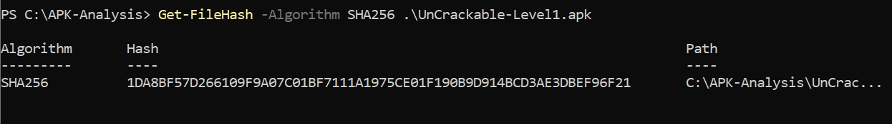 </p>
Commande utilisée :

```powershell
Get-FileHash -Algorithm SHA256 .\UnCrackable-Level1.apk
```

Objectifs :

- Assurer la traçabilité
- Garantir l’intégrité du fichier
- Permettre la reproductibilité de l’analyse


## Task 3 — Analyse du AndroidManifest et des ressources


<p align="center"> 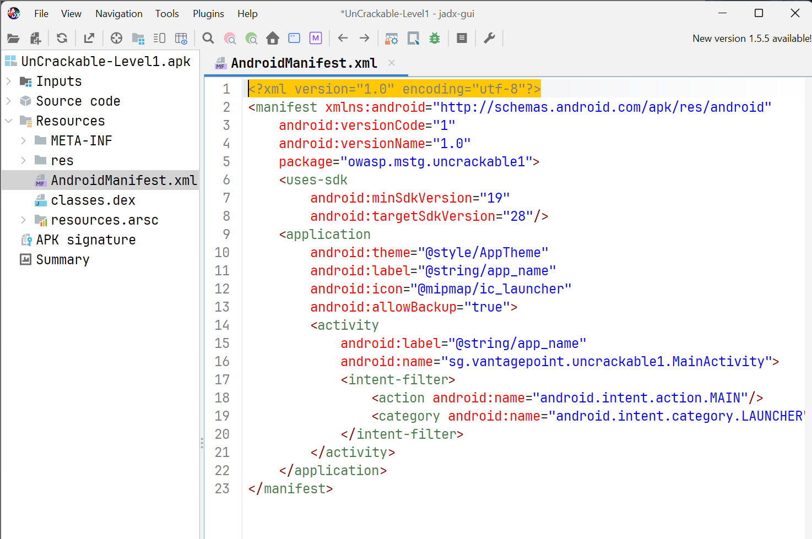 </p>

## APK analysé

- Nom du fichier : `UnCrackable-Level1.apk`
- Source : OWASP MSTG Crackme (fourni par l’enseignant)
- Outil utilisé : JADX GUI

---

# 1. Analyse du AndroidManifest.xml

Fichier analysé :  
`Resources → AndroidManifest.xml`

---

## Informations générales

| Élément | Valeur |
|----------|--------|
| Package | `owasp.mstg.uncrackable1` |
| versionCode | `1` |
| versionName | `1.0` |
| minSdkVersion | `19` (Android 4.4) |
| targetSdkVersion | `28` (Android 9) |

---

# 2. Permissions demandées

Recherche des balises :

```xml
<uses-permission>
```

## Résultat

Aucune permission n’est déclarée dans le manifeste.

## Conclusion Sécurité

L’application ne demande aucune permission système :
- Internet  
- Stockage  
- Caméra  
- Localisation  

La surface d’attaque liée aux permissions est minimale.

---

# 3. Composants déclarés

## Activity principale

```xml
<activity
    android:name="sg.vantagepoint.uncrackable1.MainActivity">
```

Cette activité contient :

```xml
<intent-filter>
    <action android:name="android.intent.action.MAIN"/>
    <category android:name="android.intent.category.LAUNCHER"/>
</intent-filter>
```

## Analyse

- `MainActivity` est l’activité principale.
- Elle est lancée au démarrage de l’application.
- Aucun autre composant n’est déclaré :
  - Service  
  - BroadcastReceiver  
  - ContentProvider  

L’application est mono-activity.

---

# 4. Composants exportés

L’attribut `android:exported` n’est pas explicitement défini.

Cependant :

- La présence d’un `intent-filter`
- Avec `MAIN` et `LAUNCHER`
- Implique que l’activité soit exportée implicitement (comportement Android < 12)

## Impact Sécurité

| Élément | Risque |
|----------|--------|
| MainActivity exportée implicitement | Faible (comportement normal pour une application launcher) |

---

# 5. Configurations sensibles

Attributs vérifiés :

- `android:debuggable`
- `android:usesCleartextTraffic`
- `android:allowBackup`

## Résultats

| Attribut | Valeur | Analyse |
|-----------|--------|----------|
| debuggable | Non présent | Mode debug non activé |
| usesCleartextTraffic | Non présent | Pas d’autorisation HTTP explicite |
| allowBackup | true | Sauvegarde autorisée |

## Analyse Sécurité

`android:allowBackup="true"` permet :

- Sauvegarde des données via ADB
- Extraction potentielle des données locales

Cela représente un risque moyen si des données sensibles sont stockées.

---

# 6. Analyse des ressources (strings.xml)

<p align="center"> 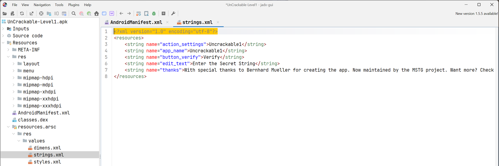 </p>

Fichier analysé :  
`res/values/strings.xml`

## Chaînes identifiées

```xml
<string name="edit_text">Enter the Secret String</string>
<string name="button_verify">Verify</string>
```

## Interprétation

- L’application attend une Secret String.
- Cela indique une logique de vérification interne.
- Aucun secret hardcodé visible.
- Aucune clé API détectée.

---
##  Analyse des autres fichiers XML
---

# 1. Analyse de activity_main.xml (Interface principale)

<p align="center"> 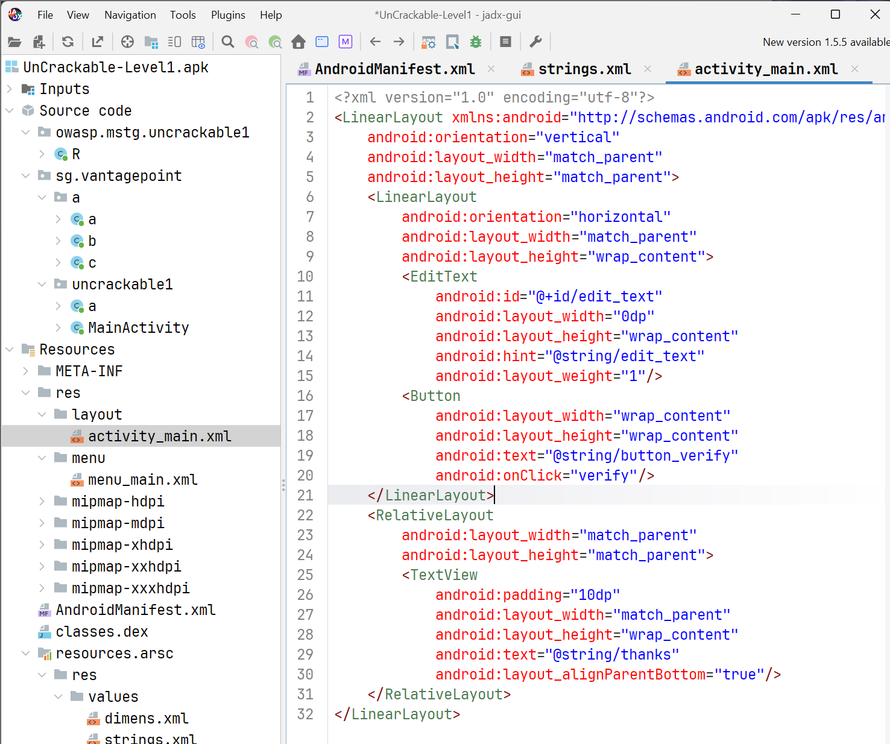 </p>

Fichier analysé :  
`res/layout/activity_main.xml`

## Structure observée

- LinearLayout principal (orientation verticale)
- Un EditText
- Un Button
- Un TextView dans un RelativeLayout

---

## Éléments importants

### 1) EditText

```xml
<EditText
    android:id="@+id/edit_text"
    android:hint="@string/edit_text"
    android:layout_weight="1"/>
```

### Analyse

- Champ de saisie utilisateur
- Le texte affiché est : "Enter the Secret String"
- L’utilisateur doit entrer une valeur secrète

Cet élément est fonctionnellement critique car il est lié à la validation du secret.

---

### 2) Button

```xml
<Button
    android:text="@string/button_verify"
    android:onClick="verify"/>
```

### Point important

`android:onClick="verify"`

Cela signifie :

- Il existe une méthode `verify()` dans `MainActivity`
- Cette méthode contient probablement la logique de validation du secret

Cet élément est central pour l’analyse dynamique et pour la Task 4, car il pointe directement vers la logique sensible dans le code Java.

---

### 3) TextView

```xml
<TextView
    android:text="@string/thanks"/>
```

### Analyse

- Message informatif affiché à l’utilisateur
- Aucun traitement logique associé
- Aucun impact sécurité

---

## Conclusion activity_main.xml

- Interface simple
- Saisie d’un secret par l’utilisateur
- Bouton déclenche la méthode `verify()`
- La logique sensible est située dans le code Java et non dans le XML

---

# 2. Analyse de menu_main.xml

<p align="center"> 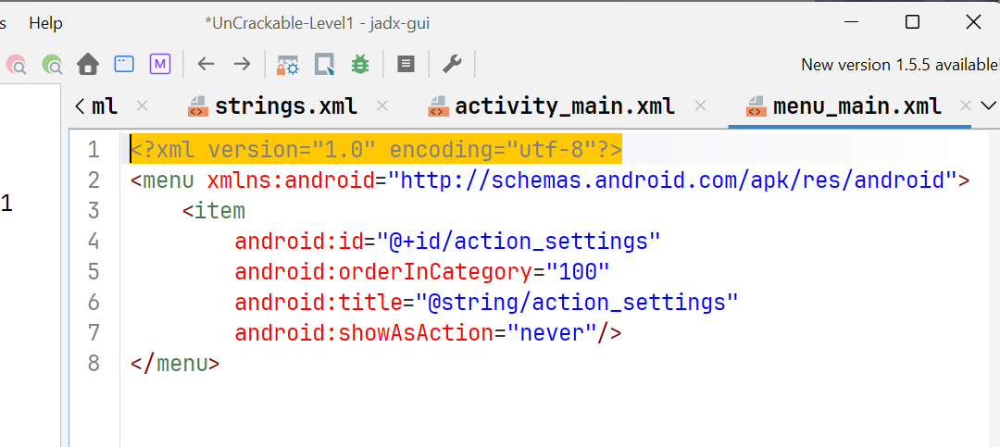 </p>

Fichier analysé :  
`res/menu/menu_main.xml`

## Contenu observé

```xml
<item
    android:id="@+id/action_settings"
    android:title="@string/action_settings"
    android:showAsAction="never"/>
```

## Analyse

- Menu simple
- Aucun lien réseau
- Aucun paramètre sensible
- Pas d’actions critiques

Conclusion : aucun risque détecté.

---

# 3. Analyse de styles.xml
<p align="center"> 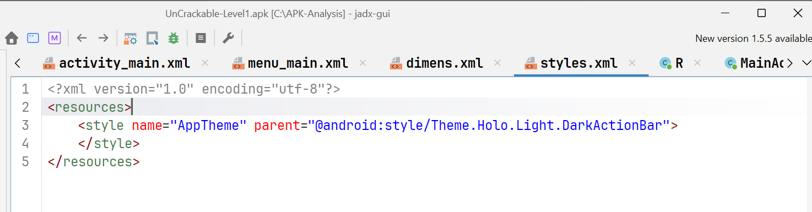 </p>

Fichier analysé :  
`res/values/styles.xml`

## Vérifications effectuées

- Thème utilisé
- Héritage du thème

Structure typique :

```xml
<style name="AppTheme" parent="...">
```

## Analyse

- Définit uniquement l’apparence visuelle
- Aucun traitement logique
- Aucun secret
- Aucun impact sécurité

Conclusion : aucun risque identifié.

---

# 4. Analyse de dimens.xml
<p align="center"> 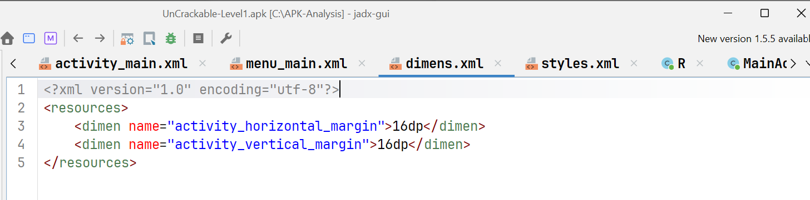 </p>

Fichier analysé :  
`res/values/dimens.xml`

## Contenu

- Marges
- Padding
- Tailles d’éléments UI

## Analyse

- Fichier purement lié à l’interface graphique
- Aucun traitement fonctionnel
- Aucun impact sécurité

Conclusion : aucun risque identifié.

---

# 5. network_security_config.xml

Recherche effectuée dans le dossier `res/xml/`

Résultat :

- Fichier absent

Analyse :

- Aucune configuration personnalisée de sécurité réseau
- L’application utilise la configuration par défaut Android

Risque : faible.

---

# Synthèse globale des fichiers XML

| Fichier | Élément critique | Niveau de risque |
|----------|------------------|------------------|
| AndroidManifest.xml | allowBackup=true | Moyen |
| activity_main.xml | onClick="verify" | Moyen |
| menu_main.xml | Aucun | Faible |
| styles.xml | Aucun | Faible |
| dimens.xml | Aucun | Faible |
| network_security_config.xml | Absent | Faible |

---

## Source Code - Analyse du code Java (MainActivity)

---

# 1. Localisation et rôle de la classe

Lors de l’exploration du code source dans JADX, la logique principale de l’application a été identifiée dans le package :

`sg.vantagepoint.uncrackable1`

La classe `MainActivity` est l’activité principale de l’application (déclarée comme launcher dans le manifeste).

Elle gère :

- L’initialisation de l’interface (`onCreate`)
- La gestion du bouton de vérification (`verify(View view)`)

Cette classe contient également plusieurs mécanismes de protection contre l’analyse.

---

# 2. Mécanisme de blocage (anti-analyse)

Une méthode privée est présente :

```java
private void a(String str)
```

## Fonctionnement observé

- Création d’une boîte de dialogue (`AlertDialog`)
- Affichage d’un message d’alerte
- Le bouton "OK" déclenche la fermeture de l’application via :

```java
System.exit(0);
```

## Interprétation

Cette fonction agit comme un mécanisme de sécurité de type "fail-fast" :

- Dès qu’une condition jugée dangereuse est détectée (root ou debug)
- L’application affiche un message
- Puis elle se termine immédiatement

Cela correspond à une stratégie de protection anti-analyse / anti-tampering.

---

# 3. Analyse de onCreate(Bundle)

Dans la méthode `onCreate`, deux contrôles de sécurité sont exécutés avant l’affichage de l’interface.

---

## A) Détection de root

Le code réalise une série de tests :

```java
c.a() || c.b() || c.c()
```

Si l’une des conditions est vraie :

- Message : "Root detected!"
- Fermeture de l’application via la méthode `a(...)`

### Interprétation

La classe `c` (dans `sg.vantagepoint.a.c`) implémente plusieurs heuristiques de détection de root.

Ces vérifications peuvent inclure :

- Présence de binaires `su`
- Permissions anormales
- Environnement modifié

Objectif : empêcher l’exécution de l’application sur un appareil rooté ou un environnement d’analyse.

---

## B) Détection du mode “debuggable”

Un second test est effectué :

```java
b.a(getApplicationContext())
```

Si la condition est vraie :

- Message : "App is debuggable!"
- Fermeture immédiate de l’application

### Interprétation

Ce contrôle cherche à détecter :

- Si l’application est en mode debug
- Si elle est exécutée dans un environnement favorable au débogage
- Si elle est instrumentée ou modifiée

C’est une mesure anti-debug / anti-reverse engineering.

---

# 4. Analyse de verify(View view)

La méthode `verify(View view)` est appelée lorsque l’utilisateur clique sur le bouton (défini dans `activity_main.xml` via `android:onClick="verify"`).

---

## Fonctionnement observé

### 1) Lecture de la saisie utilisateur

```java
getText().toString()
```

Le texte saisi dans le `EditText` est récupéré.

---

### 2) Appel de la fonction de validation

```java
a.a(string)
```

La valeur entrée par l’utilisateur est transmise à une méthode externe `a.a(...)`.

---

### 3) Affichage du résultat

Si `a.a(string)` retourne `true` :

- Titre : "Success!"
- Message : "This is the correct secret."

Sinon :

- Titre : "Nope..."
- Message : "That's not it. Try again."

---

## Interprétation

La vérification du secret est réalisée côté client (localement) via une méthode externe.

Cela signifie que :

- La logique de validation est incluse dans l’APK
- Elle est accessible par décompilation
- Elle peut être analysée statiquement

Dans une application réelle, ce serait une faiblesse majeure si cette logique représentait un mécanisme d’authentification ou de licence.

---

# 5. Résultat de l’analyse et impact sécurité

## Constats principaux

- Présence de protections anti-analyse :
  - Détection root → fermeture immédiate
  - Détection debug → fermeture immédiate

- Logique de validation du secret côté client :
  - Validation via `a.a(input)`
  - Retour "Success" ou "Nope" selon le résultat

---

# Évaluation du niveau de risque (contexte réel)

| Élément | Niveau de risque | Justification |
|----------|------------------|---------------|
| Anti-root / anti-debug | Moyen | Gêne l’analyse mais ne constitue pas une faille en soi |
| Validation du secret côté client | Moyen à élevé | Faiblesse si utilisé pour authentification réelle |

---

# Check — Task 3 (JADX GUI)

## 1. Package principal et version identifiés

Informations relevées dans `AndroidManifest.xml` :

- Package : `owasp.mstg.uncrackable1`
- versionName : `1.0`
- versionCode : `1`
- minSdkVersion : `19`
- targetSdkVersion : `28`

Statut : OK

---

## 2. Liste des permissions demandées établie

Recherche effectuée dans `AndroidManifest.xml` :

```xml
<uses-permission>
```

Résultat :

- Aucune permission déclarée

Conclusion :

- L’application ne demande aucune permission système

Statut : OK (RAS)

---

## 3. Composants exportés identifiés

Composant détecté :

- Activity : `sg.vantagepoint.uncrackable1.MainActivity`

Présence d’un `intent-filter` :

```xml
<intent-filter>
    <action android:name="android.intent.action.MAIN"/>
    <category android:name="android.intent.category.LAUNCHER"/>
</intent-filter>
```

Analyse :

- Activity principale déclarée comme launcher
- Exportation implicite (comportement Android avec targetSdkVersion 28)
- Pas besoin de l’attribut `android:exported` dans ce contexte

Statut : OK

---

## 4. Configurations sensibles notées

Vérifications effectuées dans le manifeste :

- `android:usesCleartextTraffic="true"` : absent
- `android:debuggable="true"` : absent
- `android:allowBackup="true"` : présent

Analyse :

- Pas d’autorisation explicite de trafic HTTP en clair
- Pas de mode debug activé
- Sauvegarde ADB autorisée (point sensible potentiel)

Statut : OK

---

## 5. Ressources importantes explorées

Fichiers analysés :

- `res/values/strings.xml`
  - Exemples : "Enter the Secret String", "Verify"

- `res/layout/activity_main.xml`
  - Présence de `android:onClick="verify"`

- `res/menu/menu_main.xml`
  - Menu simple sans logique sensible

- `network_security_config.xml`
  - Non présent (vérifié)

Statut : OK

---
 
# Task 4 — Observations complémentaires (Code Java)-Recherche

---
<p align="center"> 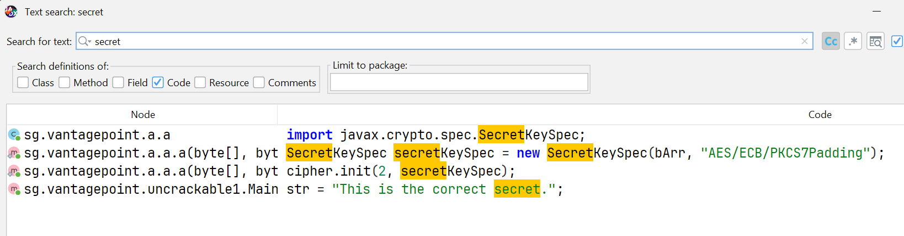 </p>
# Observation 1 — Utilisation de SecretKeySpec (Cryptographie AES)

## Valeurs trouvées

```java
import javax.crypto.spec.SecretKeySpec;

new SecretKeySpec(bArr, "AES/ECB/PKCS7Padding");
cipher.init(2, secretKeySpec);
```

## Emplacement

`sg.vantagepoint.a.a`

## Analyse

- L’application utilise la classe `SecretKeySpec`.
- Mode de chiffrement utilisé : `AES/ECB/PKCS7Padding`.
- Le mode ECB est connu pour être cryptographiquement faible et non recommandé en production.

## Niveau de risque

Moyen

## Analyse Cryptographique :

<p align="center"> 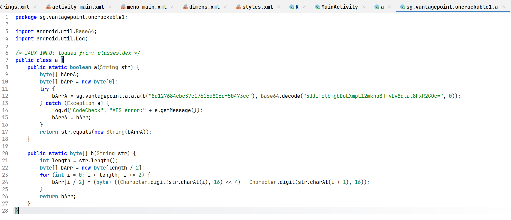 </p>
<p align="center"> 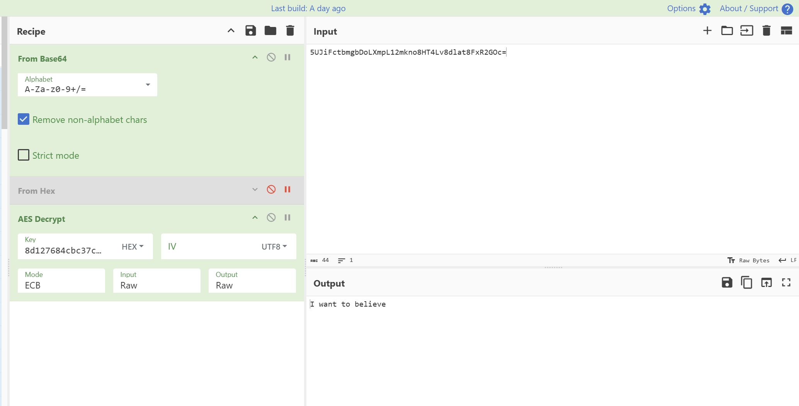 </p>
<p align="center"> 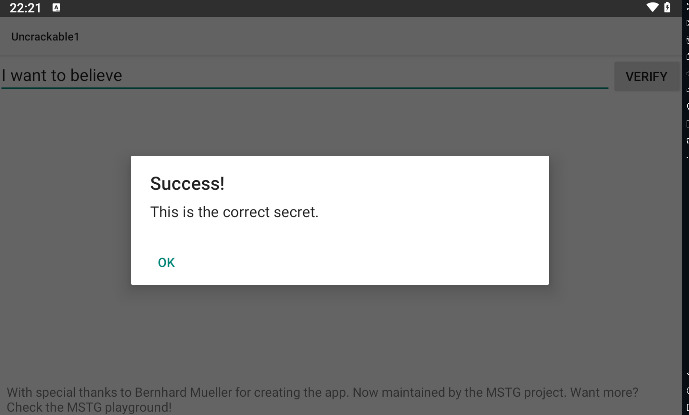 </p>

##  Résultat obtenu
En appliquant le bon déchiffrement AES, le texte clair (plaintext) est :

**`I want to believe`**

---

## 1) Ce que montre le code (JADX)

### a) La clé AES (KEY)
Dans le code :

`java
b("8d127684cbc37c17616d806cf50473cc")`

### b) Le ciphertext (texte chiffré):
`Dans le code :
Base64.decode("5UJiFctbmgbDoLXmpLl2mknno8HT4Lv8dlat8FxR2G0c=", 0)`
Le ciphertext est une chaîne Base64 qui doit être décodée en bytes avant d’être passée à AES.

## Description du problème potentiel

L’utilisation de AES en mode ECB est vulnérable aux attaques par analyse de blocs :

- Les blocs identiques produisent des blocs chiffrés identiques.
- Aucune randomisation (pas d’IV).

Même si le contexte est pédagogique (crackme), dans une application réelle cela constituerait une mauvaise pratique cryptographique.

---

# Observation 2 — Message "This is the correct secret."

## Valeur trouvée

```java
"This is the correct secret."
```

## Emplacement

`MainActivity.verify(View)`

## Analyse

- Message affiché si la validation est réussie.
- Indique qu’un secret est validé côté client.

## Niveau de risque

Moyen

## Description

La validation est effectuée localement :

- Toute la logique est embarquée dans l’APK.
- Elle peut être analysée via reverse engineering.

Dans une application réelle, cela représenterait une faiblesse de sécurité si utilisé pour authentification ou licence.

---

# Observation 3 — Détection debug
<p align="center"> 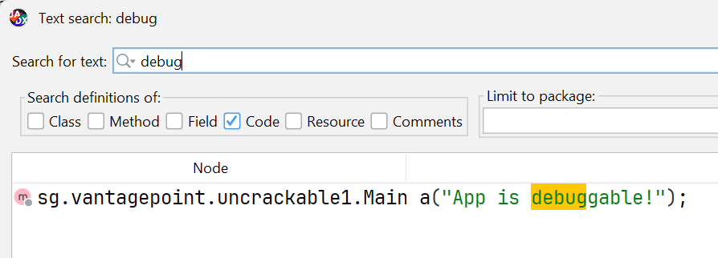 </p>
## Valeur trouvée

```java
"App is debuggable!"
```

## Emplacement

`MainActivity.onCreate()`

## Analyse

- Protection anti-debug.
- L’application refuse de s’exécuter en mode debug.

## Niveau de risque

Faible à Moyen

## Description

- Mesure défensive.
- Vise à empêcher le reverse engineering dynamique.
- Ne contient pas d’information sensible.

---

# Observation 4 — Détection test-keys
<p align="center"> 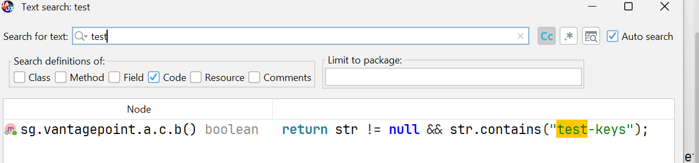 </p>
## Valeur trouvée

```java
str.contains("test-keys")
```

## Emplacement

`sg.vantagepoint.a.c.b()`

## Analyse

- Vérifie si le build contient la chaîne "test-keys".
- Indicateur typique d’un appareil rooté ou firmware custom.

## Niveau de risque

Faible

## Description

- Mécanisme de détection root.
- Ne contient pas d’information sensible.
- Protection classique contre les environnements modifiés.

---

# Observation 5 — Aucune URL / API / token trouvé

## Recherche effectuée

Mots-clés analysés :

- http
- https
- .com
- api
- token
- apikey
- password
- jwt
- oauth
- firebase
- crashlytics

## Résultat

- Aucune occurrence trouvée.

## Niveau de risque

Faible

## Description

- L’application ne communique avec aucun serveur distant.
- Aucun secret réseau codé en dur.
- Aucun token, clé API ou mot de passe identifié.

---

# Synthèse — Task 4

| Élément | Emplacement | Niveau de risque |
|----------|-------------|------------------|
| AES/ECB/PKCS7Padding | sg.vantagepoint.a.a | Moyen |
| Validation du secret côté client | MainActivity.verify | Moyen |
| Détection debug | MainActivity.onCreate | Faible / Moyen |
| Détection test-keys | sg.vantagepoint.a.c | Faible |
| Aucune clé / API / token | Recherche globale | Faible |

---

# OWASP MSTG – UnCrackable Level 1 (Analyse Root Detection)

## Objectif
Observer et documenter le comportement de l’application **UnCrackable Level 1** lorsqu’elle est exécutée sur un environnement **rooté**, puis analyser la logique de détection root côté application.

---
<p align="center"> 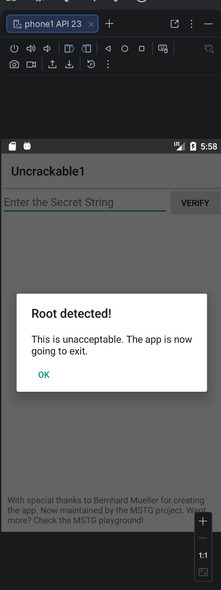 </p>
## 1) Comportement observé (environnement rooté)

### Observation
Au lancement de l’application sur un émulateur rooté, une alerte s’affiche :

> **“Root detected!”**  
> *This is unacceptable. The app is now going to exit.*

### Impact
- L’application se ferme immédiatement après l’affichage de l’alerte.
- Le flux normal (écran “Enter the Secret String”) n’est pas accessible sur cet environnement.

---

## 2) Localisation du code de détection root

### Point d’entrée
La détection root est déclenchée depuis :

- `sg.vantagepoint.uncrackable1.MainActivity#onCreate()`

Extrait logique (simplifié) :

`java
if (c.a() || c.b() || c.c()) {
    a("Root detected!");
}`

## Implémentation

La logique de détection root est implémentée dans :

- `sg.vantagepoint.a.c`

---

## Vérifications effectuées (vue fonctionnelle)

Les contrôles sont répartis en trois méthodes :

- `c.a()` : recherche d’un binaire **su** accessible (ex. via `PATH` / emplacements courants)
- `c.b()` : vérifie si `Build.TAGS` contient **"test-keys"**
- `c.c()` : recherche d’artefacts “root” connus (indicateurs classiques)

> **Remarque :** ces vérifications sont typiquement utilisées pour détecter des environnements modifiés (root, build debug, etc.).

---

## Instrumentation (contexte de test)

### Machine hôte
- **OS :** Windows  
- **Outils :** Python + `frida-tools` (installés via `pip`)

### Émulateur
- `adb` détecte correctement l’AVD  
- Un `frida-server` correspondant au couple **(version Frida / ABI)** est déployé sur l’émulateur
<p align="center"> 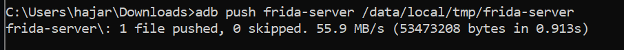 </p>
<p align="center"> 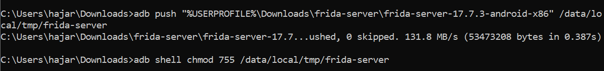 </p>
<p align="center"> 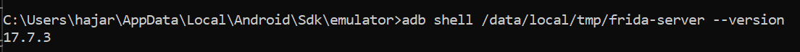 </p>
<p align="center"> 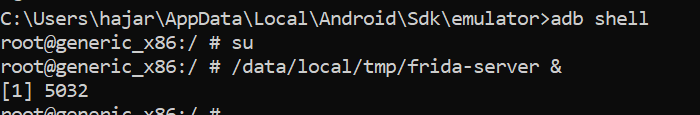 </p>
<p align="center"> 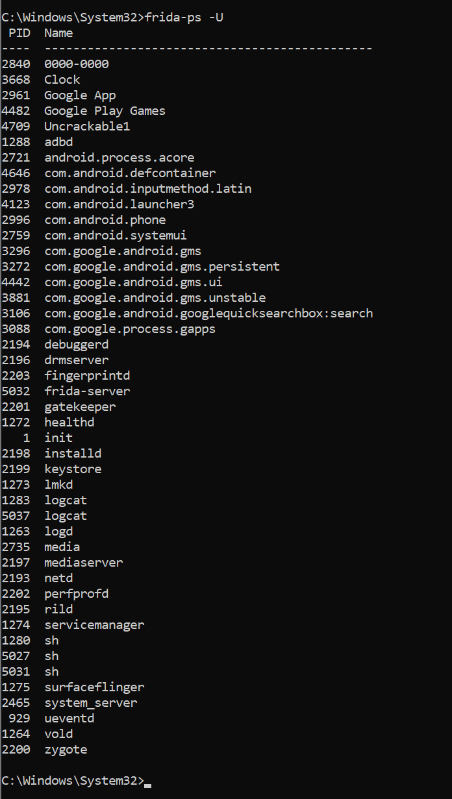 </p>
## Script utiliser :

`fichier creer : bypass.js`

` script

    Java.perform(function () { 
    var rootClass = Java.use("sg.vantagepoint.a.c");

    rootClass.a.implementation = function () {
        console.log("Bypassing c.a()");
        return false;
    };

    rootClass.b.implementation = function () {
        console.log("Bypassing c.b()");
        return false;
    };

    rootClass.c.implementation = function () {
        console.log("Bypassing c.c()");
        return false;
    };});`


<p align="center"> 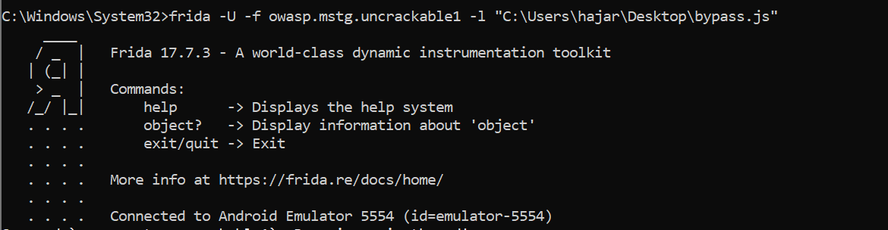 </p>
# Apres Execution :
## L’application se lance désormais normalement sans afficher "Root detected!".


# Task 5 — Conversion DEX → JAR avec dex2jar

---

# Objectif

Transformer le bytecode Android (`classes.dex`) en fichier JAR afin de réaliser une analyse alternative avec un autre décompilateur (JD-GUI).

---

# 1. Extraction des fichiers DEX depuis l’APK

<p align="center"> 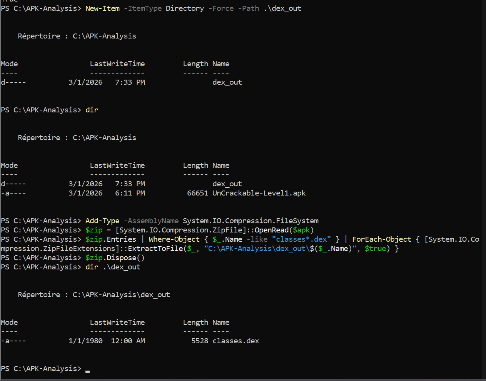 </p>
Depuis le dossier de travail :

```
C:\APK-Analysis
```

Les fichiers `classes*.dex` ont été extraits à l’aide de PowerShell en utilisant la bibliothèque `System.IO.Compression`.

## Commande utilisée

```powershell
Add-Type -AssemblyName System.IO.Compression.FileSystem
$zip = [System.IO.Compression.ZipFile]::OpenRead("C:\APK-Analysis\UnCrackable-Level1.apk")
$zip.Entries | Where-Object { $_.Name -like "classes*.dex" } | ForEach-Object {
    [System.IO.Compression.ZipFileExtensions]::ExtractToFile($_, "C:\APK-Analysis\dex_out\$($_.Name)", $true)
}
$zip.Dispose()
```

## Résultat

Le fichier suivant a été extrait :

```
C:\APK-Analysis\dex_out\classes.dex
```

Observation :

- Aucun multi-dex détecté.
- Un seul fichier DEX présent dans l’APK.

---

# 2. Conversion DEX → JAR
<p align="center"> 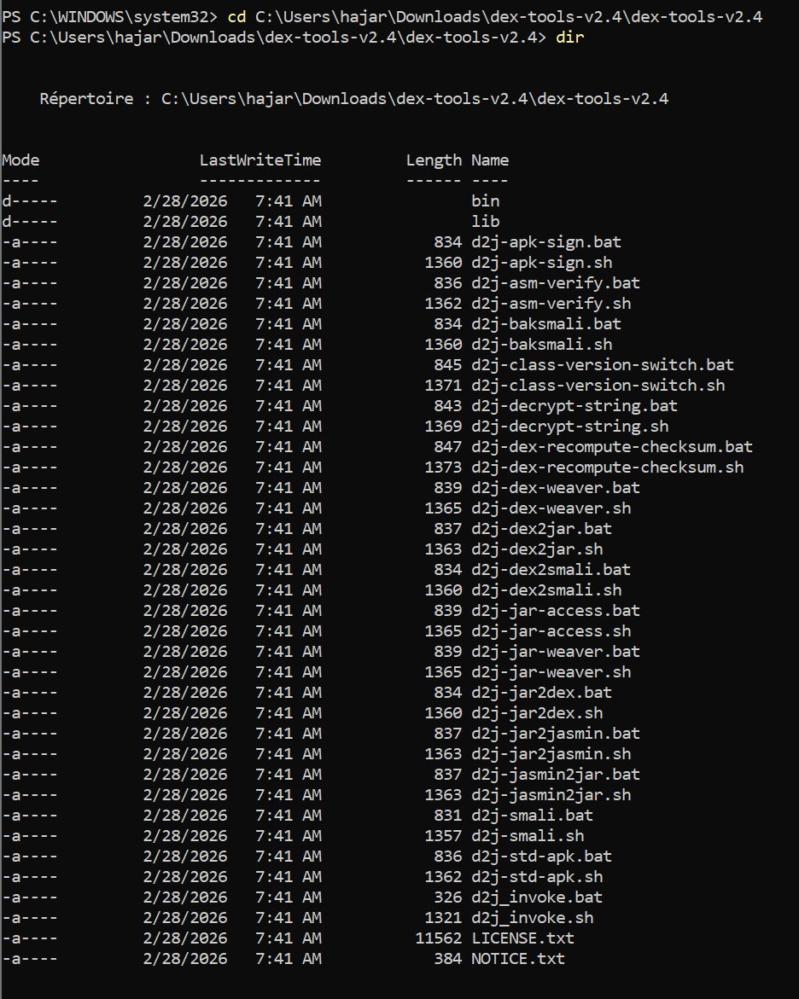 </p>
<p align="center"> 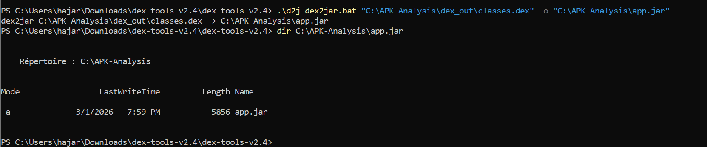 </p>

L’outil `dex2jar` (version 2.4) a été utilisé pour convertir le fichier `classes.dex` en fichier JAR.

## Commande exécutée

```bash
.\d2j-dex2jar.bat "C:\APK-Analysis\dex_out\classes.dex" -o "C:\APK-Analysis\app.jar"
```

## Résultat

Le fichier suivant a été généré avec succès :

```
C:\APK-Analysis\app.jar
```

- Aucune erreur Java signalée.
- Aucune exception lors de la conversion.
- Processus terminé correctement.

---

#  Comparaison JADX GUI vs JD-GUI

---

# Objectif

Comparer les différentes approches de décompilation afin d’obtenir une analyse plus complète du code de l’application Android.

---

# 1. Lancement de JD-GUI

<p align="center"> 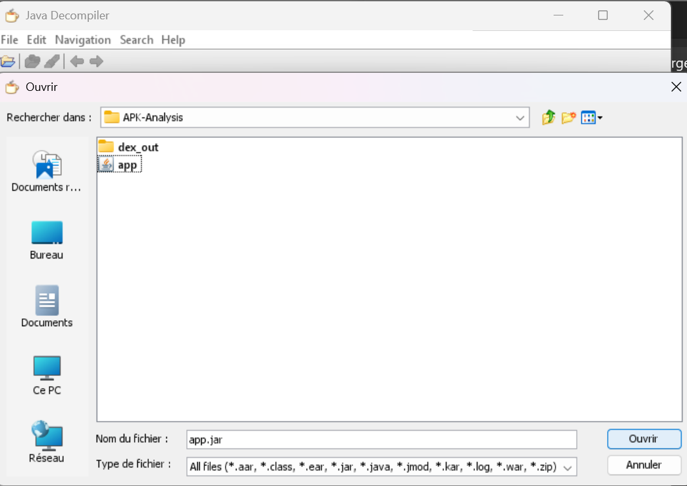 </p>

Le fichier `app.jar` généré lors du Task 5 a été ouvert dans JD-GUI.

---

# 2. Ouverture du fichier JAR

Fichier ouvert :

```
C:\APK-Analysis\app.jar
```

Structure observée dans JD-GUI :

<p align="center"> 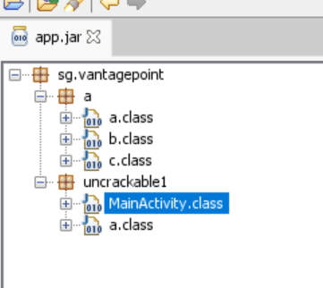 </p>

---

# 3. Classe comparée-MainActivity

<p align="center"> 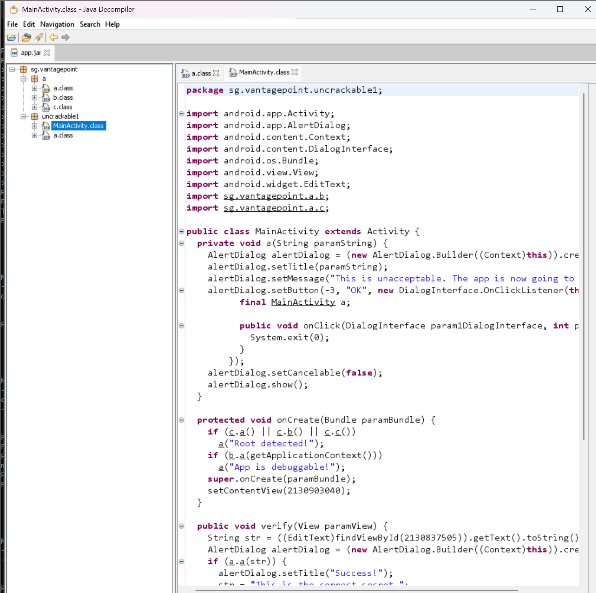 </p>
Classe analysée dans les deux outils :

```
sg.vantagepoint.uncrackable1.MainActivity
```

Méthodes étudiées :

- `onCreate(Bundle)`
- `verify(View)`
- `a(String)`

---

# 4. Comparaison détaillée

## Navigation et organisation

### JADX GUI

- Affiche la structure Android complète :
  - AndroidManifest.xml
  - Dossier `res/`
  - Fichiers XML
  - Code Java
- Navigation intuitive orientée Android

### JD-GUI

- Affiche uniquement :
  - Packages
  - Classes Java
- Aucun accès aux ressources Android

---

## Lisibilité du code

### JADX

- Code restructuré
- Références Android conservées (`R.layout`, `R.id`)
- Structure claire et compréhensible

### JD-GUI

- Code très fidèle au bytecode
- Paramètres renommés (`paramBundle`, `paramView`)
- Structure plus brute

---

## Gestion des constructions spécifiques à Android

### JADX

Affiche par exemple :

```java
setContentView(R.layout.activity_main);
```

Possibilité d’ouvrir directement `activity_main.xml`.

### JD-GUI

Affiche :

```java
setContentView(2130903040);
```

Les références Android sont remplacées par des constantes numériques.

---

## Impact de l’obfuscation

Dans les deux outils :

- Classes `a`, `b`, `c` restent obfusquées.
- Méthodes peu explicites.

Différences :

- JD-GUI conserve une structure très proche du bytecode original.
- JADX améliore légèrement la lisibilité en reconstruisant les références Android.

---

## Affichage des ressources

| Outil   | Accès aux ressources |
|----------|----------------------|
| JADX     | Oui (XML, Manifest, strings) |
| JD-GUI   | Non |

---

# 5. Documentation des différences principales

| Aspect | JADX GUI | JD-GUI |
|--------|----------|--------|
| Navigation | Structure Android complète | Structure Java uniquement |
| Ressources | Accès direct aux XML | Aucun accès aux ressources |
| Références Android | R.layout.activity_main | 2130903040 |
| Lisibilité | Plus lisible pour Android | Plus brut |
| Fidélité bytecode | Reconstruction partielle | Très fidèle |

---

# Forces et faiblesses

## JADX GUI — Forces

- Vue complète de l’APK
- Adapté à l’analyse Android
- Accès aux ressources
- Navigation intuitive

## JADX GUI — Faiblesses

- Reconstruction partielle du code
- Moins fidèle au bytecode brut

---

## JD-GUI — Forces

- Très fidèle au bytecode Java
- Analyse technique fine
- Léger et rapide

## JD-GUI — Faiblesses

- Aucun accès aux ressources Android
- Moins adapté à l’analyse spécifique APK

---

# Conclusion

Pour une analyse statique Android :

- JADX GUI est l’outil principal recommandé.
- JD-GUI est un outil complémentaire utile pour vérifier la fidélité du bytecode.

L’utilisation combinée des deux outils permet une analyse plus fiable, plus technique et plus complète.


# Rapport d’Analyse Statique  
## UnCrackable-Level1

---

## Informations générales

- **Date d'analyse :** 01/03/2026  
- **Analyste :** Hajar Chaira  
- **APK analysé :** UnCrackable-Level1.apk  
- **Version :** 1.0 (versionCode 1)  
- **Package :** owasp.mstg.uncrackable1  
- **Provenance :** OWASP MSTG Crackme (fourni par notre enseignant)

### Outils utilisés

- JADX GUI v1.5.5  
- dex2jar v2.4  
- JD-GUI (version standard Windows)

---

## Résumé exécutif

L’analyse statique de l’application **UnCrackable-Level1** a permis d’identifier trois faiblesses potentielles de sécurité.

Les principales préoccupations concernent :

- L’utilisation d’un mode de chiffrement faible (AES/ECB)
- La présence d’un mécanisme de détection root/debug contournable
- L’activation de `android:allowBackup="true"`

Le niveau de risque global est évalué comme **Moyen**.

---

## Actions prioritaires recommandées

1. Remplacer `AES/ECB` par `AES/GCM` ou `AES/CBC` avec IV sécurisé.
2. Supprimer ou renforcer les mécanismes anti-debug/root.
3. Désactiver `android:allowBackup` en environnement de production.

---

## Constats détaillés

### Constat #1 : Utilisation d’AES en mode ECB

**Sévérité :** Moyenne

#### Description

Le code utilise l’algorithme :

```text
AES/ECB/PKCS7Padding
```

Le mode ECB est considéré comme cryptographiquement faible car il ne protège pas contre l’analyse de motifs répétitifs dans les blocs chiffrés.

#### Localisation

- Classe : `sg.vantagepoint.a.a`  
- Utilisation de `SecretKeySpec` avec `"AES/ECB/PKCS7Padding"`

#### Impact potentiel

- Vulnérabilité à l’analyse de blocs répétitifs  
- Faible résistance face à certaines attaques cryptographiques  

#### Remédiation recommandée

Utiliser :

- `AES/GCM` (recommandé)
- ou `AES/CBC` avec IV aléatoire sécurisé

---

### Constat #2 : Mécanisme anti-root et anti-debug contournable

**Sévérité :** Moyenne

#### Description

Dans `MainActivity.onCreate()` :

```java
if (c.a() || c.b() || c.c()) {
    a("Root detected!");
}
```

Et :

```java
if (b.a(getApplicationContext())) {
    a("App is debuggable!");
}
```

Ces vérifications peuvent être contournées via :

- Modification (patching) de l’APK
- Hooking dynamique (ex. Frida)
- Modification du bytecode

#### Localisation

- Classe : `sg.vantagepoint.uncrackable1.MainActivity`

#### Impact potentiel

- Bypass des protections de sécurité
- Exécution de code modifié
- Facilitation du reverse engineering

#### Remédiation recommandée

- Intégrer la Play Integrity API (ex-SafetyNet)
- Implémenter des contrôles en code natif (NDK)
- Ajouter des mécanismes de détection d’instrumentation (ex. détection Frida)

---

### Constat #3 : allowBackup activé

**Sévérité :** Faible à Moyenne

#### Description

Dans `AndroidManifest.xml` :

```xml
android:allowBackup="true"
```

Cette configuration autorise la sauvegarde des données de l’application via ADB.

#### Localisation

- Fichier : `AndroidManifest.xml`

#### Impact potentiel

- Extraction de données locales
- Récupération d’informations sensibles

#### Remédiation recommandée

Désactiver en production :

```xml
android:allowBackup="false"
```

---

## Annexes

### Permissions demandées

Aucune permission déclarée dans le manifeste.

---

### Composants exportés

**MainActivity**

Export implicite via `intent-filter` :

- Action : `android.intent.action.MAIN`
- Category : `android.intent.category.LAUNCHER`

---

### Éléments supplémentaires observés

- Application mono-activité
- Logique de vérification du secret côté client
- Code partiellement obfusqué (classes `a`, `b`, `c`)
- Aucune URL distante détectée
- Aucun token API détecté

---

## Conclusion générale

L’application **UnCrackable-Level1** est conçue comme un exercice pédagogique de reverse engineering.

Bien qu’elle ne présente pas de vulnérabilité critique en contexte réel de production, l’analyse a mis en évidence :

- Un mode de chiffrement faible
- Des protections anti-debug/root contournables
- Une configuration `allowBackup` activée

L’utilisation combinée de JADX et JD-GUI a permis une compréhension complète du fonctionnement interne de l’application.

---
